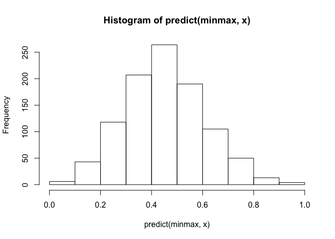

Preparation R
-------------

This package is used to temporarily relieve swelling, burning, pain, and
itching caused by data preparation. Heavily influenced by sklearn
preprocessing module. As such it aims to implement the Transformer API
and allow for pipelines that can be saved and applied to new datasets.

It will eventually include methods for outputting to PMML or json to
assist with productionalizing data preparation steps. It currently only
works with single variables, but once the patterns are formalized it
will extend to data.frames.

    # Dummy data
    z1 <- rpois(1e5, 4)

    ## create a standard normalization scaler
    scaler <- StandardScaler()

    scaler$fit(z1)
    hist(scaler$transform(z1))

    ## verify that the inverse transform is equal to the original data
    all.equal(scaler$inverse_transform(scaler$transform(z1)), z1)

    ## [1] TRUE

### Piplines

Pipelines simply chain together transformers in a list. They implement
the Transformer API as well and support the same methods:

    ## chain together in a pipeline
    p <- pipeline(
      StandardScaler(),
      MinMaxScaler(feature_range=c(-1, 1))
    )

    z2 <- p$fit_transform(z1)
    z3 <- p$inverse_transform(z2)

    ## verify the pipeline can be undone
    all.equal(z1, z3)

    ## [1] TRUE
