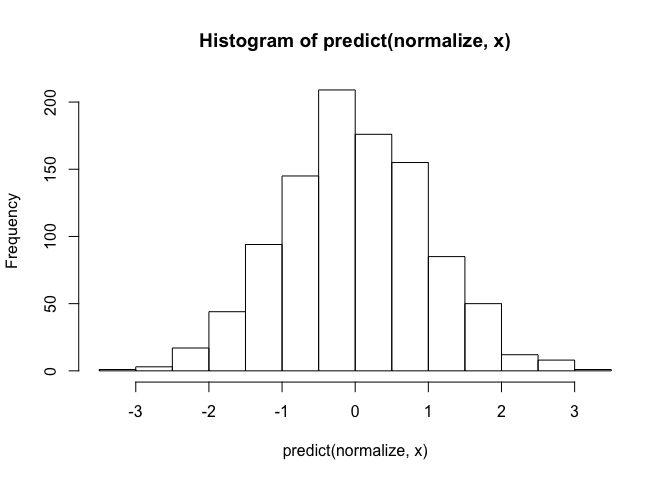
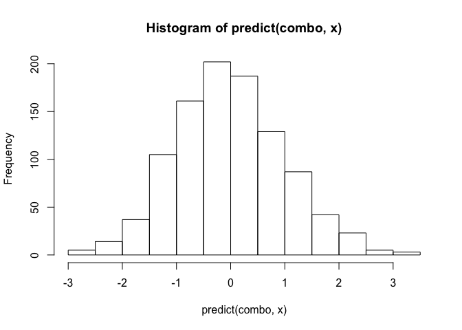

Preparation R
-------------

This package is used to temporarily relieve swelling, burning, pain, and
itching caused by data preparation.

    x <- rnorm(1000)

    minmax <- prep_center(method="min") %|>% prep_scale(method="range")
    normalize <- prep_center(method="mean") %|>% prep_scale(method="sd")

    hist(predict(minmax, x))

    hist(predict(normalize, x))

    ## compose further
    combo <- minmax %|>% normalize

    hist(predict(combo, x))

